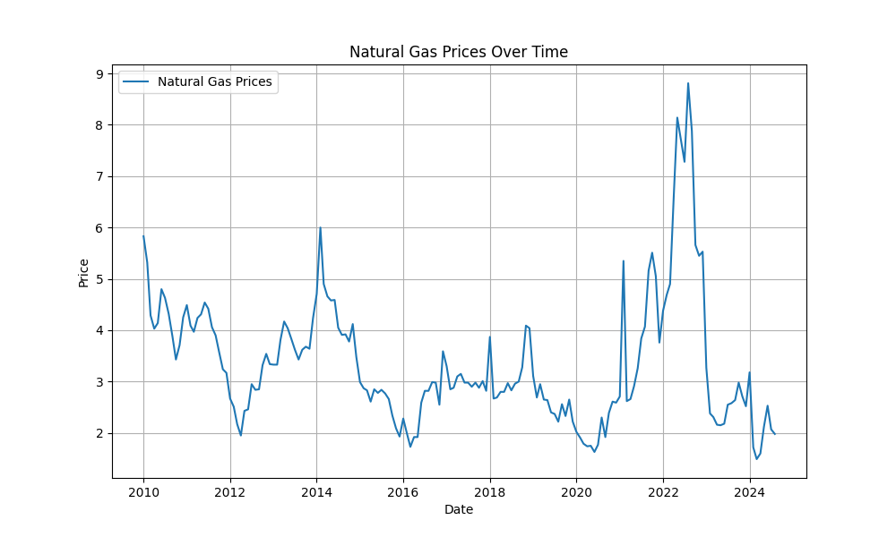
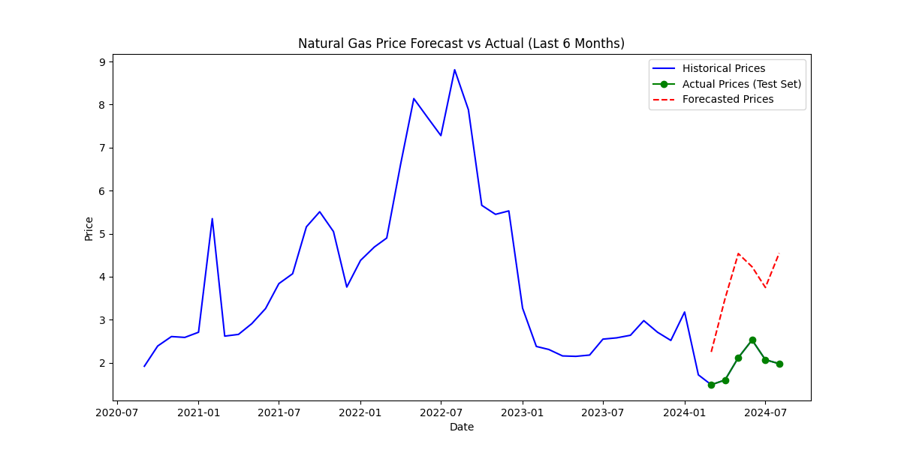
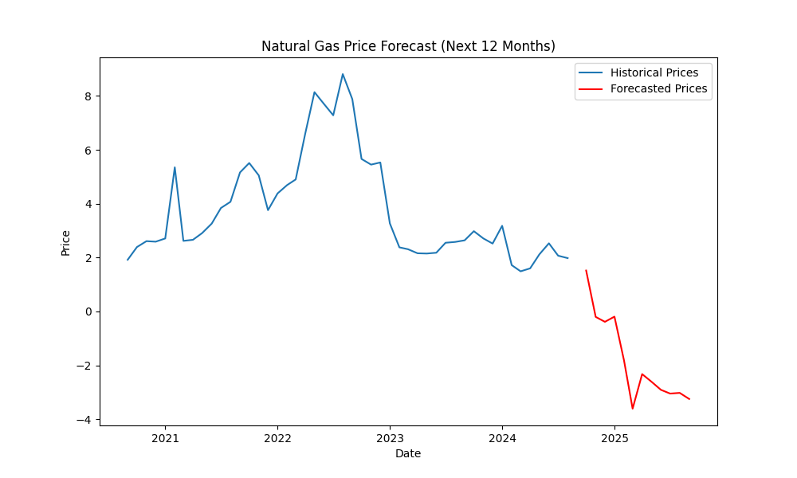
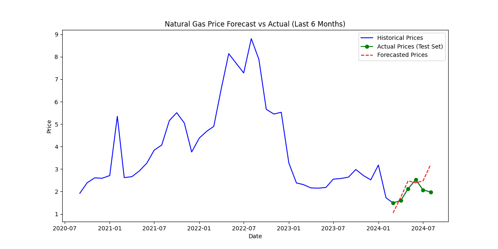
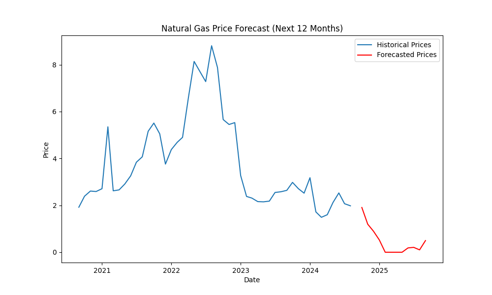

# Natural Gas Price Analysis With ARIMA

## Project Overview

This project analyzes Henry Hub Natural Gas Spot Price data to model and predict future gas prices. The dataset used spans several years and has been sourced from a public resource provided by Thomson Reuters, accessible at the U.S. Energy Information Administration (EIA): [Henry Hub Natural Gas Spot Price](https://www.eia.gov/dnav/ng/hist/rngwhhdM.htm).

The objective of the project is to:

- Analyze historical trends in natural gas prices.
- Build a predictive model to forecast future prices.
- Provide insights into price fluctuations.

## Features

- **Data Preprocessing**: Cleaning and preparing the raw data for analysis.
- **Exploratory Data Analysis (EDA)**: Visualizing key trends and patterns.
- **Predictive Modeling**: Implementing time series models (e.g., ARIMA, SARIMA) to forecast future prices.
- **Extrapolation**: Estimating prices beyond the available data up to one year into the future.
- **Visualization**: Graphs and plots showcasing the predictions and model performance.

## Dataset

The dataset used for this project is from the EIA's historical Henry Hub Natural Gas Spot Prices. Data can be accessed and downloaded from the following link:
- **[Henry Hub Natural Gas Spot Price (EIA)](https://www.eia.gov/dnav/ng/hist/rngwhhdM.htm)**

## Original Data

The figure below illustrates the original Henry Hub Natural Gas Spot Prices from 2010 to 2024.



## Running the Code

To make it easier for you to run the project without needing to set up a local environment, you can run the notebook on **Google Colab**. Follow these steps:

1. Open Google Colab: [Google Colab](https://colab.research.google.com/).
2. Upload the Jupyter notebook (`Ver03_Task01_Natural_Gas_Analysis.ipynb`) to Colab.
3. Make sure the required libraries are installed. You can add this code block at the beginning of the notebook to install any missing packages:
    ```python
    !pip install pandas matplotlib seaborn statsmodels
    ```
4. Run the notebook in sequence to analyze the data and make predictions.

## Usage

After running the notebook, you will be able to:
- View exploratory visualizations.
- Train the predictive model.
- Make predictions for future gas prices.

Additionally, there is functionality to input a specific date, and the model will return an estimated price for that date (including extrapolation for future dates).

## Model Testing

### ARIMA Model

The ARIMA model was chosen after running an auto-ARIMA process. The model was tested using a train-test split, where the last 6 months of the data were reserved as the test set. The following figure shows the testing performance of the ARIMA model:



After testing, the model was trained on the entire dataset and used to predict natural gas prices for the next 12 months, as shown in the figure below:



### SARIMA Model

Similarly, the SARIMA model was tested using a train-test split, with the last 6 months reserved for testing. The SARIMA model captures the seasonality of the data better. Below is the testing performance:



The following figure displays the SARIMA model’s predictions for the next 12 months, based on the entire dataset:



## Results

The models were able to predict natural gas prices, though the performance of the ARIMA model was suboptimal. During testing, the ARIMA model achieved a relatively high mean squared error (MSE) of 3.716, indicating poor predictive accuracy. Furthermore, many of the predicted values generated by the ARIMA model were negative, which is not plausible for natural gas prices.

On the other hand, the SARIMA model was more effective at capturing the underlying patterns and seasonality in the data. In the testing phase, SARIMA produced a significantly lower MSE of 0.338, which is more acceptable for this dataset. Its predictions aligned more closely with the observed trends, demonstrating a better fit, as shown in the "Model Testing" section.

It’s important to handle missing values carefully, as the diff function may occasionally produce NaN values. Failure to address these NaN values before feeding the data into the model can lead to errors and inaccurate predictions. Proper data preprocessing is essential for ensuring robust model performance.

## Technologies Used

- **Python**: For data analysis and modeling.
- **Google Colab**: For running the Jupyter notebook online.
- **Libraries**: 
  - `pandas` for data manipulation
  - `matplotlib` and `seaborn` for visualization
  - `statsmodels` for time series modeling
  - `pmdarima` for *auto-arima* function

## Author

- **Ngo Trieu Gia Gia** - [GitHub Profile](https://github.com/giagia2002123)

## Acknowledgments

- Data sourced from the [U.S. Energy Information Administration](https://www.eia.gov/).

